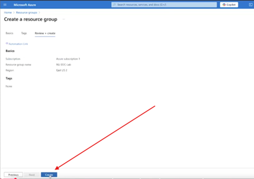
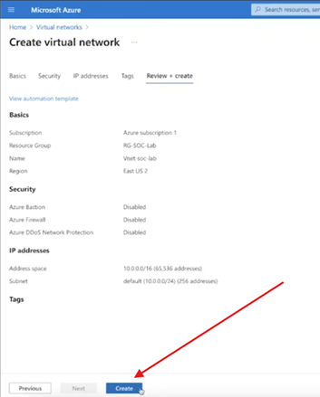
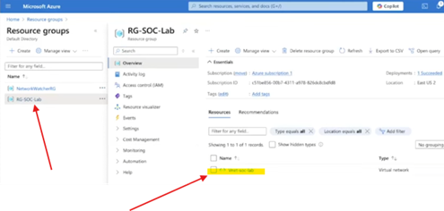
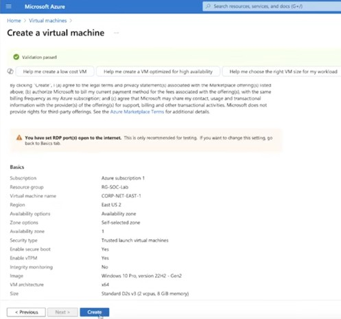
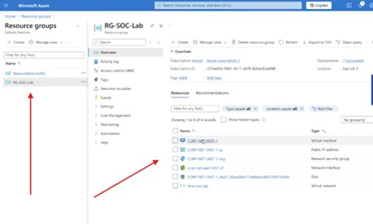

**Azure SIEM Honeypot Lab**

Overview

Deployed a cloud-based honeypot in Microsoft Azure to capture and analyze real-world attack traffic using Microsoft Defender and KQL.

**Technologies**

Microsoft Azure

Microsoft Defender (SIEM)

Log Analytics Workspace

KQL (Kusto Query Language)

Windows Event Logs

**1. Initial Setup**
Created resource group, virtual network, and VM.

**2. Network Security Group (NSG)**

Configured inbound rules to allow traffic for honeypot behavior.

**3. Disable Windows Firewall**

Disabled firewall to increase visibility of inbound attacks.

**4. Log Collection & SIEM (Sentinel)**

Forwarded Windows Security logs to Log Analytics and connected Microsoft Defender.

**5. KQL Queries**

Queried failed login attempts (Event ID 4625):

SecurityEvent
| where EventID == 4625
| summarize FailureCount = count() by IpAddress
| order by FailureCount desc

**6. Attack Map (GeoIP Enrichment)**

Mapped attacker IPs to geographic locations.

**Results**

Captured real failed login attempts

Identified attacker IPs and locations

Visualized global attack patterns

Observed over 6,000+ failed login attempts within 18 hours

**Skills Demonstrated**

SIEM configuration and log analysis

Threat detection and investigation

KQL querying

Azure cloud security

